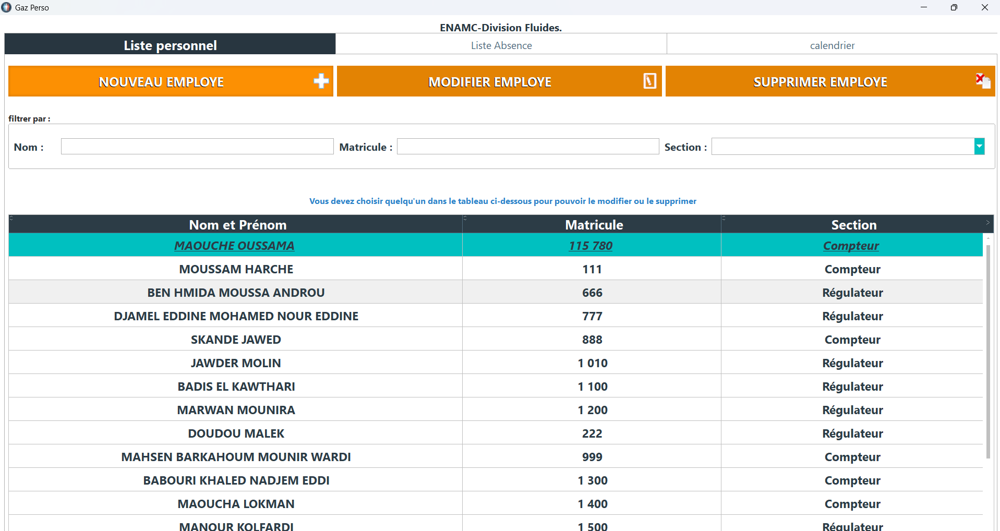
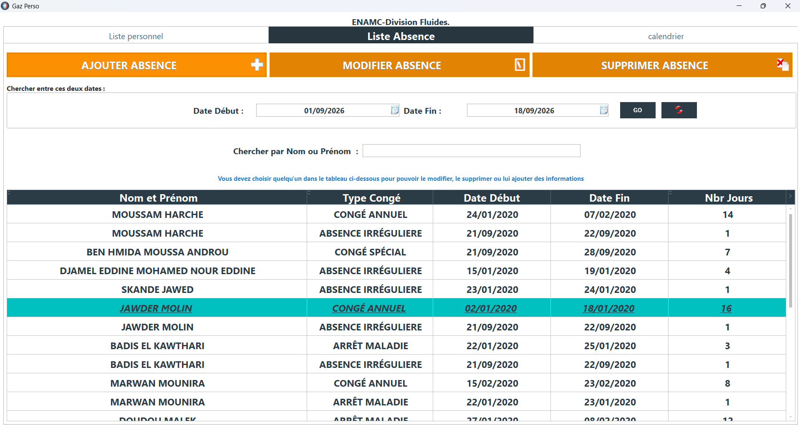
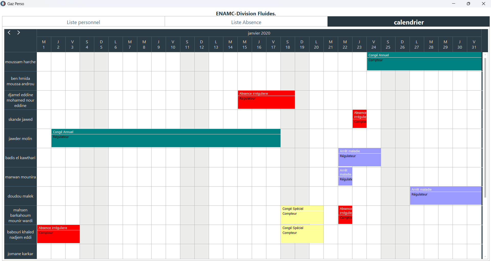

# Production Workforce Leave & Absence Management Application

Windows desktop application I designed and developed in-house while working in the production department at **EN-AMC (later SAIEG — Sonelgaz Group)**.

The department produced gas meters and gas regulators and had a workforce of roughly 100 people. With a lean supervisory structure, manually tracking employee records, annual leave, sick leave and other absences alongside production responsibilities was time-consuming and difficult to keep consistent. I built the application on my own initiative to centralize that follow-up and give the production team a clearer view of leave history and workforce availability.

## At a glance

| Area | Details |
|---|---|
| Professional context | Production department at EN-AMC (later SAIEG — Sonelgaz Group) |
| My contribution | Independently initiated, designed, developed and functionally tested the application |
| Application type | Windows desktop business application |
| Technologies | WINDEV / WLanguage, HFSQL |
| Main modules | Employees, leave/absence records, monthly calendar |
| Main capabilities | CRUD workflows, search/filtering, date-range tracking, calendar visualization |
| Workforce context | Roughly 100 production employees |

## Why I built it

Employee follow-up was only one part of the production-engineering workload. The same small management structure also had to monitor products, production activity and production lines.

Tracking leave and absences manually across roughly 100 employees made it difficult to maintain a clear history and review each employee's leave/absence record consistently across teams.

I created the application to:

- centralize employee records;
- keep a structured leave/absence history;
- make records easier to search and filter;
- provide a monthly visual overview of workforce absences;
- support more consistent review of leave and absence history across teams.

## Testing and validation

I also tested the application I developed, checking its core workflows from data entry through stored records and visual follow-up. This was developer-led functional testing rather than a separate independent QA campaign.

The checks covered the main implemented behavior, including:

- adding, modifying and deleting employee records;
- adding, modifying and deleting leave/absence records;
- employee-to-absence relationships;
- start/end dates and displayed duration;
- search and filtering by employee, number, section and date range;
- monthly calendar representation of recorded absences;
- data persistence after create/update/delete actions.

The application was used in the production-department context, providing practical validation of the workflows it was built to support.

No separate formal test plan or execution log is published in this repository. The testing description is based on first-hand project context together with the surviving project artifacts and application screens.

## Employee management

The employee module supports:

- employee listing;
- add, modify and delete workflows;
- employee number and section information;
- filtering by name;
- filtering by employee number;
- filtering by production section.

## Leave & absence management

The absence module supports:

- leave/absence records linked to employees;
- add, modify and delete workflows;
- multiple absence/leave categories;
- start and end dates;
- displayed duration in days;
- filtering by date range;
- search by employee name.

## Monthly calendar

The calendar provides a visual overview in addition to the tabular records.

Employees are displayed as rows and days as columns, while recorded absence periods appear as colored ranges across the month. This makes overlapping leave and workforce availability easier to review at a glance.

## Technical design

The application uses a small relational model with two main entities:

**Employee**
- employee ID;
- name;
- employee number;
- section.

**Absence**
- absence ID;
- employee ID;
- absence type;
- start date;
- end date.

Each absence record is linked to an employee through the employee ID.

## What this project demonstrates

The application was built as a focused production-support tool. It demonstrates:

- multi-screen desktop development;
- CRUD business workflows;
- relational data modeling;
- search and filtering;
- date-range handling;
- employee-to-absence relationships;
- calendar-style data visualization;
- translating an operational production need into an internal software tool.

The screenshots use test/demo data. The original HFSQL data and WINDEV project files remain private.

See:

- [Technical Notes](docs/technical-notes.md)
- [Evidence & Confidentiality](evidence/README.md)
